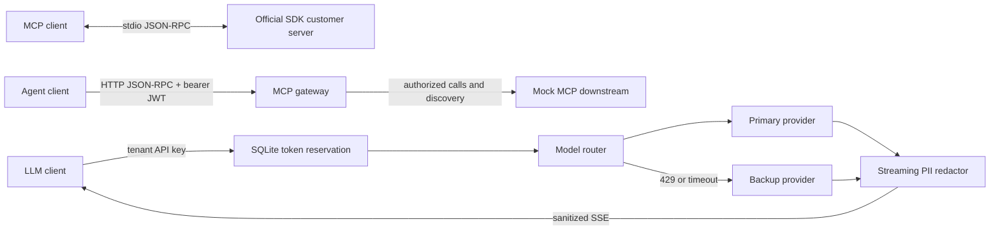

# Design and evaluation notes

## Architecture



Task 1's stdio service is independent. Tasks 2–4 share the FastAPI application and
HTTP connection pool. The mock HTTP MCP endpoint is a deliberately small JSON-RPC
fixture; the actual MCP SDK implementation is the stdio service.

## Task 1: protocol and stdio

Pydantic models are both the source of the advertised JSON Schemas and the execution
validator. Strict types and `extra="forbid"` reject coercion and unexpected fields.
Reason length is additionally checked after trimming. Validation details expose field
names and error kinds, without copying input values into responses.

The server uses the official Python SDK **1.30.0** low-level `Server` and `stdio_server`.
Its tool decorator catches exceptions and produces tool-level errors. A direct
`CallToolRequest` handler preserves `McpError(-32602)` for the assessment's explicit
validation requirement. SDK initialization, capabilities, dispatch, and result serialization
remain in use. This SDK-specific integration is pinned and covered by an official-client test.

The SDK transport does not itself answer malformed JSON lines with a parse-error response.
A bounded input adapter reads at most 1 MiB per line, rejects duplicate keys and non-finite
numbers, validates envelopes, and passes valid lines to the official transport. Oversized
lines are drained to the next newline; subsequent requests remain usable. A shared output
lock serializes complete UTF-8 lines from both SDK responses and framing errors.

The assessment's `-32602` argument-validation rule differs from the newer recommendation
to return application validation failures as `isError` tool results. Unknown customers
are business failures and do use `isError`. [MCP tool error guidance](https://modelcontextprotocol.io/specification/2025-11-25/server/tools)
and the [official Python SDK](https://github.com/modelcontextprotocol/python-sdk) explain
the protocol and implementation context.

Mock data contains `CUST-00001`. `trigger_refund` generates a simulated receipt and never
connects to a payment processor. A real refund integration needs separate business
authorization, durable idempotency, and payment-provider error handling.

## Task 2: authorization and forwarding

JWTs are verified with HS256, a configured secret of at least 32 bytes, fixed issuer and
audience, expiry, issued-at time, subject, and an allowlisted `role` claim. The gateway
does not trust a decoded-but-unverified role. Demo tokens last one hour.

The gateway authenticates every MCP request. It checks the **decoded** `params.name`
before performing downstream I/O. Only `admin` can invoke names beginning exactly with
`admin_`. `tools/list` remains transparent, as required; discovery is not a permission grant.

Accepted payload bytes, JSON response bytes, status, and selected MCP headers are preserved.
Client bearer credentials are not passed to the downstream. An optional separate
`MCP_DOWNSTREAM_TOKEN` supplies the gateway's service identity. Redirects and environment
proxy discovery are disabled; URLs come from server configuration, never request input.

The scope is **HTTP POST with a single MCP JSON-RPC object and JSON response**. Batches
are rejected rather than creating an authorization bypass. Valid notifications do not
receive JSON-RPC responses; unauthorized notification calls are blocked with an empty HTTP
403. Malformed envelopes receive protocol errors. This is not a full stateful Streamable
HTTP proxy: GET/SSE, session resumption, and server-initiated requests are outside Task 2.

Keep the mock downstream bound to loopback. In a real deployment, downstream services
must accept traffic only from the gateway, using service authentication and network policy.
Client TLS terminates at a trusted ingress or the service. Do not expose the unauthenticated
mock provider or its prompt-based fault controls externally.

## Task 3: streaming redaction

The SSE parser incrementally decodes UTF-8, handles CRLF and multiline data fields, and
ignores comments and unrelated fields. Events are limited to 64 KiB. Malformed UTF-8,
oversized events, incomplete final frames, unexpected event schemas, missing usage, and
missing `[DONE]` terminate with a sanitized error event. No upstream metadata is echoed.

The redactor holds only the current ambiguous lexical candidate, with a **512-character
maximum**. It masks:

- ASCII email addresses with a dotted domain, including plus tags and subdomains.
- SSN-shaped `DDD-DD-DDDD` sequences.
- Card-shaped runs of 13 or more digits, optionally separated by single spaces, tabs, or
  hyphens. Runs beyond normal 13–19 digit card lengths are also masked conservatively,
  including two cards separated only by a space. Luhn validity is deliberately not required.

Ordinary completed words are emitted immediately. An incomplete email or number is held
until its boundary is known. This makes the result independent of how provider deltas are
partitioned. There is no safe way to emit `alice` immediately if the next delta could be
`@example.com`; the bounded delay is intentional. A candidate reaching the size limit is
replaced once and its remainder discarded until the next boundary, keeping memory bounded
even for pathological unbroken input. This can redact very long harmless identifiers.

Response state is O(candidate limit + event limit), not O(response length); no transcript
is accumulated. HTTP backpressure follows the async generator. Response content is capped
at `min(1 MiB, max_tokens * 128)` characters and 60 seconds of total stream processing.
The HTTP client's socket read timeout is 10 seconds. Client cancellation closes the upstream
with shielded cleanup; failed streams never flush unfinished candidates.

This is a deterministic pattern guardrail, not comprehensive DLP. It does not detect names,
addresses, international identifiers, Unicode/obfuscated emails, spelled-out digits, or
encoded PII. Number-shape matching can produce false positives. TTFT depends on word
boundaries and provider pace, not just HTTP chunk arrival. Pattern detection cannot decide
whether a value is sensitive in every context.

## Task 4: quota, concurrency, and fallback

### Token accounting

Each validated API key maps to a server-configured tenant. SQLite stores a SHA-256 digest
of tenant plus API key as the bucket identifier; raw keys never enter the DB. Separate keys
have separate quotas, matching the requested per-tenant-API-key limit.

Admission reserves `tokenize(prompt) + max_tokens`. The included adapter uses the
`cl100k_base` tokenizer and requests plain text, with no hidden chat-message overhead.
On success, the reservation is settled to provider usage. Non-streaming output usage is
also checked against local tokenization; streaming usage is authoritative provider metadata,
validated to match the input count and stay within the requested completion limit.

The quota meters **one logical gateway completion**, including its fallback, rather than
provider billing across attempts. A timed-out provider may still bill work even after
cancellation. Billing reconciliation across providers would need a separate ledger.
On failure, disconnect, absent usage, or process crash, the full reservation remains until
it expires. This conservative behavior avoids repeatedly getting unmetered failed requests.

Quota is an admission-time rolling window `(now - 60, now]`, not a fixed minute bucket.
Finished requests retain their admission timestamp. The DB transaction prunes expired rows,
sums current reservations, checks capacity, and inserts a reservation atomically.
`BEGIN IMMEDIATE`, WAL mode, and a five-second busy timeout serialize competing writers,
including separate workers sharing the same database. [SQLite transaction semantics](https://www.sqlite.org/lang_transaction.html)
are the basis for the concurrency design.

The persisted clock floor prevents backwards wall-clock changes from reopening earlier
budgets. A forward clock jump still advances this wall-clock window. Expired rows are removed
on subsequent admission; idle databases do not run a background janitor. Exact-at-cutoff
eviction, required-capacity `Retry-After`, restarts, settlement, and concurrent independent
connections are tested.

SQLite is an on-disk, single-host deployment choice. Use a shared local filesystem path
for multiple workers. SQLite WAL is not a distributed cross-host quota service or an NFS
coordination mechanism. A saturated DB fails closed with a sanitized gateway error.

### Routing deadlines

For `POST /v1/completions`, the primary has a **3,000 ms total deadline**, including headers
and complete body consumption. A primary 429 or timeout triggers exactly one backup attempt,
also bounded to three seconds. Other HTTP failures, malformed data, or transport errors do
not trigger additional retries. Cancellation is propagated; no detached primary task keeps
running inside the gateway after timeout.

For streaming, the three-second fallback policy covers obtaining response headers. Once a
stream is accepted, the gateway does not switch providers midstream: it emits a sanitized
error if the accepted stream fails. Switching after content delivery risks duplicating or
contradicting output. The separately bounded stream deadlines are described above.

Errors expose a stable code, public message, and gateway-generated request ID. Internal logs
record request ID and exception type, without raw prompts, tokens, or upstream stack traces.
Model responses are not logged.

## Provider adapter contract

`PRIMARY_URL` and `BACKUP_URL` accept:

```json
{"prompt":"Hi","max_tokens":100,"stream":false}
```

The response for non-streaming generation is:

```json
{"text":"Hello","usage":{"prompt_tokens":1,"completion_tokens":1}}
```

With `stream: true`, the provider returns `Content-Type: text/event-stream`, followed by:

```text
data: {"delta":"Hello "}

data: {"delta":"world"}

data: {"usage":{"prompt_tokens":1,"completion_tokens":2}}

data: [DONE]

```

Each data event contains exactly one delta or one usage object; usage appears once, after
all deltas. The provider must enforce `max_tokens` and report counts using the configured
tokenizer. Only this adapter contract is supported out of the box. An external vendor
adapter must translate its schema and select its actual tokenizer or conservative token
budget including any request-format overhead. Providers must be trusted to report usage
accurately; the gateway is not an upstream billing auditor.

The HTTP client uses connection pooling and explicit cleanup following
[HTTPX's async streaming guidance](https://www.python-httpx.org/async/). Strict model
validation follows [Pydantic strict-mode behavior](https://docs.pydantic.dev/latest/concepts/strict_mode/).

## Reproducibility and test scope

`requirements.lock` pins the tested dependency set, with the SDK's Windows dependency
guarded by a platform marker. CI tests Windows and Linux on Python 3.11 and 3.13.
The tokenizer may fetch its public vocabulary asset on first startup; it is warmed before
the gateway starts accepting requests. To run offline, prepopulate `TIKTOKEN_CACHE_DIR`.

Tests exercise the official SDK client, raw stdio subprocesses, HTTP mocks, real HTTP
subprocesses, deterministic time, independent SQLite connections, character-by-character
PII streams, all sample split points, randomized chunk partitions, and oversized inputs.
Local timing measurements describe the mock workload and are not production latency claims.
